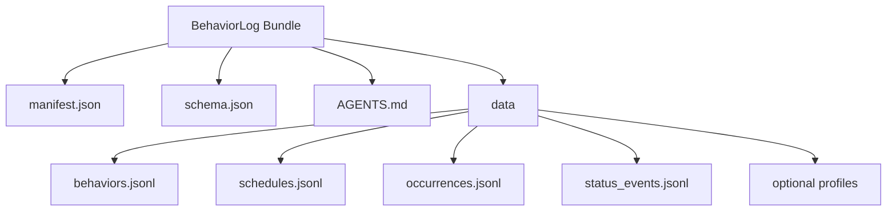
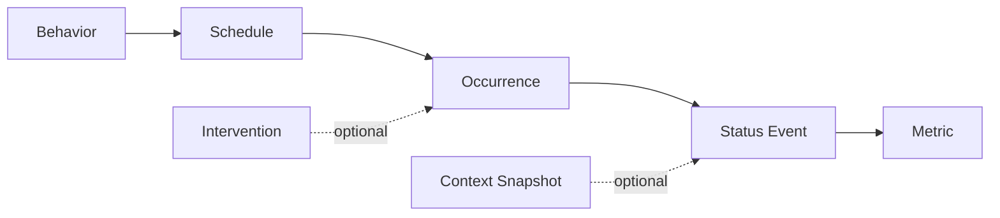
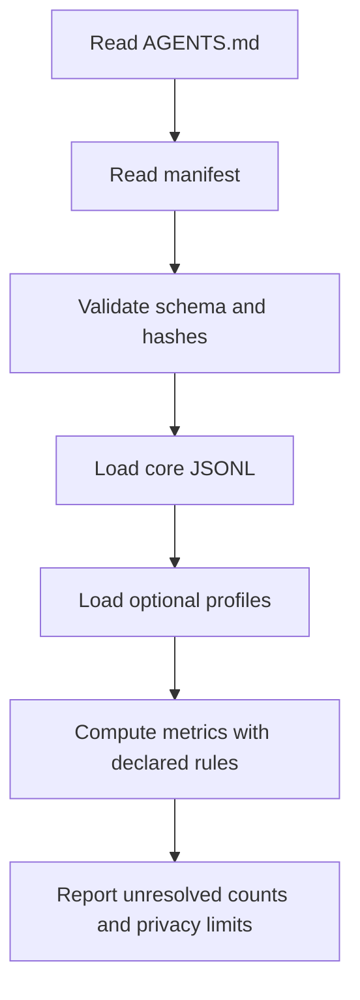

# Suggested Diagrams

These diagrams are intentionally not rendered in the core spec. They are useful additions for a GitHub README or documentation site.

## Bundle structure

## Core data chain

## Agent reading flow

